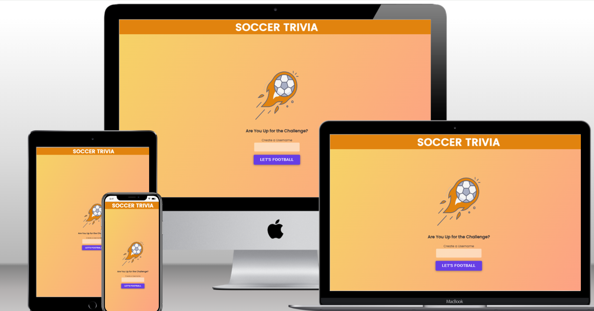

# Soccer Trivia - Online Quiz Game

[Visit the Soccer Trivia online quiz here](https://deepak-spider.github.io/soccer-trivia/)

___

# Table of Contents

1. [Overview](#1-overview)
2. [Features](#2-features)  
    * [Home Page](#home-page)
    * [Quiz Page](#quiz-page)
    * [Score Display](#score-display)
    * [Future Features](#future-features)

# 1. Overview

The aim of this project is to  showcase proficiency in HTML, CSS, and JavaScript, emphasising a mobile-first approach while ensuring responsiveness on tablet and desktop devices. Soccer Trivia is designed to be compatible with popular browsers, including Chrome, Firefox, Edge, and Safari.

The quiz comprises ten questions, each offering four answer options, with only one correct.
It prioritises interactivity, engaging users through seamless keyboard navigation and accessibility features compatible with screen readers.

# 2. Features

## Home Page

* Header

The Header, which displays the name of the quiz.

* The Logo

The Logo is displayed on the main area of the Home Page as an image. The Soccer Trivia logo is a creative and eye-catching design that conveys the theme of the game. The logo features a stylized soccer ball encased within a dynamic, flame-like orange shape, suggesting motion or intensity.
The soccer ball represents the main topic, which is soccer trivia. It also implies that your project is fun, engaging, and interactive, as soccer is a popular and exciting sport.
The flame-like shape around the soccer ball symbolises the challenge and difficulty of the trivia questions, as well as the passion and enthusiasm of the players. It also creates a contrast with the white background, making the logo stand out and attract attention.
The logo is simple, yet memorable and distinctive. It captures the essence of the game and communicates it effectively to the target audience.

* Text and Username Input

A user-friendly text input field encourages players to personalise their experience by entering a unique username before diving into the game. To ensure a seamless start, an error message appears beneath the input field if the user attempts to commence the quiz without providing a valid username.

Once a valid username is entered, participants can swiftly initiate the quiz by either pressing the 'Enter' key on their keyboard or navigating to the designated button below. This simple and interactive approach enhances user engagement, making the commencement of the soccer quiz both effortless and enjoyable.

* A Start Button

One key component of the Home Page is the Start Button. It is large and offers better contrast possible with the light-colored background. When it is focused on or hovered over, it changes color slightly and scales up.

## Quiz page

The Main area consists of the following features:

* Question Count and Progress Bar

Enhancing the user experience, the Soccer Quiz Game features a dynamic display at the top of the quiz container, keeping participants informed about their progress.

The Question Count provides a quick reference, indicating the current question out of the total of 10. This feature ensures players are aware of their position in the quiz, making the experience more engaging and structured.

Complementing the Question Count is the Progress Bar, a visual representation of the quiz progression. The capsule-shaped bar fills up as users click the 'Next' button, visually indicating progress. Conversely, it empties when the 'Previous' button is selected, offering an intuitive representation of the quiz journey. This graphical element adds a touch of interactivity, allowing players to visually track their advancement through the quiz.

* Question and Answer Options

Immersing players in the soccer quiz experience, each question unfolds one at a time, creating an engaging and focused atmosphere. Below each question, a block of answer options awaits the player's decision.

The Answer Options are presented as a set of stylized buttons, each accompanied by a radio button for selection. Players can interact by either clicking on the word or the stylized radio button, providing a seamless and intuitive experience. The buttons feature a focus and hover effect, enhancing accessibility and user interaction.

Upon selection, each button undergoes a color change, accompanied by a subtle animation on the radio button to signify that it is checked. This visual feedback ensures players are aware of their choices and adds a touch of dynamism to the quiz.

For keyboard users, easy navigation is facilitated through the use of the 'arrow keys.' Selection can be made with the 'space' or 'enter' key, offering an inclusive and user-friendly experience. Players can then effortlessly tab through to the navigation buttons, maintaining accessibility for all participants.

* Navigation and Results Buttons

Navigating through the Soccer Quiz Game is a breeze with strategically placed Navigation Buttons at the bottom of the quiz container.

The Next Button emerges on the right with the first question, guiding players seamlessly to subsequent questions. As users progress, the Previous Button makes its appearance on the left, facilitating easy backtracking from the second question onward. The Results Button takes center stage when players reach the final question, signaling the culmination of their soccer quiz journey.

These buttons come alive with a hover and focus effect, enhancing the interactive experience. For keyboard users, clicking on the Next or Previous button intelligently brings the focus back to the top with each transition. This thoughtful design choice eliminates the need for users to navigate back to the answer options using the 'tab' and 'shift' keys, making the tabbing order more intuitive and user-friendly.

* Enhanced Player Guidance

Ensuring a seamless experience, the Soccer Quiz Game introduces a valuable Error-Check Feature designed for player convenience.

If a player attempts to proceed to the Results section without selecting an answer option for every question, a personalised error message grabs their attention. Leveraging their entered username, the message prompts them to review and complete any unanswered questions. This personalised touch not only attracts the player's attention but also offers a more engaging and tailored experience.

Players can then navigate back effortlessly, reassess their answers, and ensure a comprehensive quiz submission. This thoughtful feature reinforces user-friendly design principles, providing players with clear guidance and an opportunity for a more thorough soccer quiz experience.

## Score Display

The culmination of the Soccer Quiz Game experience is marked by the captivating Score Display, a window into the player's performance and a pathway to further enjoyment.

Featuring an Icon representing the score outcome, this visual element provides instant feedback on the player's achievement. The accompanying Remark adds a personalized touch, dynamically changing to reward, incentivize, or playfully challenge the player based on their total score. This not only acknowledges their efforts but also motivates them for future quiz endeavors.

The inclusion of the Play Again Button beckons players to embark on another round of soccer trivia. Clicking this button seamlessly refreshes the quiz, taking the player back to the starting point without the need to re-insert their username. This ensures a smooth and enticing loop for players to revisit the quiz and aim for an even better score.

The Score Display encapsulates the essence of the soccer quiz journey, offering a visually appealing and rewarding conclusion to the player's adventure.

## Future Features

The following features are planning to be added in the future.

* Diverse Question Pool:

Introducing more questions sourced, perhaps, through an external API.
Potential inclusion of a difficulty level option, providing users with varying levels of challenge.

* Expanded Score Display Outcomes:

As the question pool expands, so too will the range of outcomes in the Score Display.
A more nuanced and tailored feedback system based on the player's performance.

* Player Data Storage:

Implementing the Google Sheets API to store player data.
Creating a competitive edge by displaying top scores, encouraging players to return and aim for the leaderboard.

* Social Media Sharing Option:

Enabling players to share their scores via social media platforms.
Transforming the quiz into a social experience, enticing new players to join the fun.

These forthcoming enhancements aim to not only diversify the quiz content but also foster a competitive and interactive community around the Soccer Quiz Game. Stay tuned for an even more engaging and dynamic quiz experience!

# 3. User Experience (UX)

## Site Goals

The Soccer Quiz site (Soccer Trivia) is meant to serve as an engaging and interactive platform for soccer enthusiasts to test and enhance their knowledge of the sport. This site aims to accomplish the following

* To offer an entertaining and dynamic soccer quiz experience that caters to users with varying levels of soccer knowledge.
* To create a sense of competition and engagement by incorporating features like personalized feedback and potential future leaderboards.
* To encourage repeat visits through the implementation of a player data storage system, enticing users to improve their scores and compete for top positions.

## Target Audience

The target audience for the Soccer Trivia is a diverse group of soccer and quiz enthusiasts, including those who seek an interactive and competitive platform to test and showcase their soccer knowledge.

## User Stories

* As a soccer fan, I want to challenge my knowledge of the sport through engaging quiz questions.
* As a user, I want a user-friendly interface that allows me to navigate the quiz effortlessly.
* As a soccer enthusiast, I want a visually appealing design that reflects the excitement of the game.

## Structure

The Soccer Quiz Game embraces a minimalist design to provide users with a seamless and focused gaming experience. The simplicity and consistency in its structure ensure that users can fully concentrate on the thrill of the quiz.

There are three pages in the layout; a home page, a quiz page, and a score display page.
Quiz questions take center stage with a clear and large font, and answer options are neatly displayed below. To enhance user interaction, answer options change color upon selection, providing a dynamic visual experience. On larger screens, the layout adjusts intelligently, presenting answer options in two columns for easy navigation without constant scrolling.

To aid concentration, pagination for questions and answers is implemented, allowing players to focus on one question at a time. The inclusion of a "Previous" button empowers users to review and adjust their answers before submitting for results.

The Score Display at the end of the quiz maintains clarity, offering visual icons for feedback. Additionally, a personalised touch is added with the use of the player's username in the congratulatory or commiserate text, creating a more engaging and customised conclusion to their soccer quiz journey.

## Design

### Colour Scheme
### Typography
### Wireframes

[Back to Top](#table-of-contents)

# 4. Technologies

## Languages Used
HTML, CSS and JavaScript were used to create this interactive online game.

### Frameworks, Libraries & Programs Used

- [Balsamiq](https://balsamiq.com/) - to create Wireframes.
- [Gitpod](https://www.gitpod.io/) - cross platform cloud IDE to deploy workspace environment to Github.
- [Github](https://github.com/) - to store and dislay all files and assets for the website.
- [Google Fonts](https://fonts.google.com/) - to import the fonts used on the website.
- [Google Dev Tools](https://developer.chrome.com/docs/) - to troubleshoot, test and solve issues with any styling.
- [W3C Markup Validator](https://validator.w3.org/) - to check the source code of my html files for any bugs.
- [W3C CSS Validator](https://jigsaw.w3.org/css-validator/) - to check the source code of my css file for any bugs.
- [JSHint](https://jshint.com/) - to check the JavaScript code for any bugs.
- [Canva](https://www.canva.com/) - to optimise images.
- [Techsini](https://techsini.com/multi-mockup/) - to showcase the website on different devices.

[Back to Top](#table-of-contents)

# Testing

## Validator Testing

#### HTML

The code from the following HTML files was passed through the [Official W3C Markup Validator](https://validator.w3.org/)
* index.html

Document checking completed. No errors or warnings to show.

* quiz.html

Document checking completed. No errors or warnings to show.

#### CSS

The code from the stylesheet was passed through the [Official W3C CSS Validator](https://jigsaw.w3.org/css-validator/)

Congratulations! No Error Found.

#### JavaScript

* No errors were found when passing through the [Official Jshint Validator](https://jshint.com/)

## Manual Testing

### Browser Compatibility

Quizzified was tested manually and is compatible with the following browsers:
* Google Chrome
* Edge
* Firefox

# 7. Deployment

This online quiz was deployed to [GitHub Pages](https://pages.github.com/).  The steps taken in deploying this project are as follows:

1. Log on to GitHub and select 'soccer-trivia' from the list of repositories.
2. Click on 'Settings' on the menu just below the repository's name.
3. Navigate to the left side menu and click on 'Pages' in the 'Code and Automation' section.
4. In the Main area under 'Build and Deployment', click on the source dropdown menu and select the 'Deploy from Branch' selection.
5. In the 'Branch' section select the `main` branch and the `/(root)` folder.
6. Click 'Save'.
7. A message that the site is ready to be deployed appears just under the 'GitHub Pages' heading.  After refreshing the page, the link to the deployed site appears in a different color. 
8. Click on the link to go to the live deployed page. 

The live link can be found [here](https://deepak-spider.github.io/soccer-trivia/)

[Back to Top](#table-of-contents)

# 8. Citation of Sources

[W3Schools](https://www.w3schools.com/js/)

[MDN](https://developer.mozilla.org/en-US/docs/Web/JavaScript)

[Stack Overflow](https://stackoverflow.com/)

[CSS Tricks](https://css-tricks.com)

[Google fonts used throughout the website](https://fonts.google.com/)

[Font Awesome Icons](https://fontawesome.com/icons)

[Back to Top](#table-of-contents)

